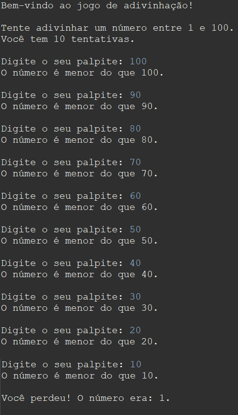

# Jogo de Adivinhação em Java
[](https://github.com/Caiodeassisguimaraes/jogoDeAdivinhacao/blob/main/LICENSE)

## Objetivo: 
Implementar um jogo de adivinhação em Java, onde o jogador tenta adivinhar
um número aleatório gerado pelo programa.

## Requisitos:
* O jogo deve gerar um número aleatório no intervalo de 1 a 100.
* O jogador deve ter um número máximo de tentativas para adivinhar o número.
* O programa deve fornecer pistas ao jogador, informando se o número a ser
adivinhado é maior ou menor do que o palpite atual.
* O jogo deve terminar quando o jogador adivinhar corretamente o número ou
quando o número máximo de tentativas for atingido.

## Instruções:

* Crie uma classe chamada ```GuessingGame``` que irá conter a lógica principal do jogo
* Implemente métodos na classe ```GuessingGame``` para gerar um número aleatório, receber palpites do jogador e verificar se o palpite está correto.
* Utilize métodos auxiliares, se necessário, para exibir mensagens e obter entrada do usuário.
* Crie uma classe chamada ```Main``` com um método ```main()``` que irá iniciar o jogo.
* Utilize a orientação a objetos, boas práticas de programação e padrões de desenvolvimento (SOLID, etc.).

## Exemplos de uso do jogo:

### Exemplo 1:
<!---->


### Exemplo 2:
<!---->



## Modelo Conceitual
<!---->


## Autor:
Caio de Assis Guimarães

https://www.linkedin.com/in/caiodeassisguimaraes/


 
